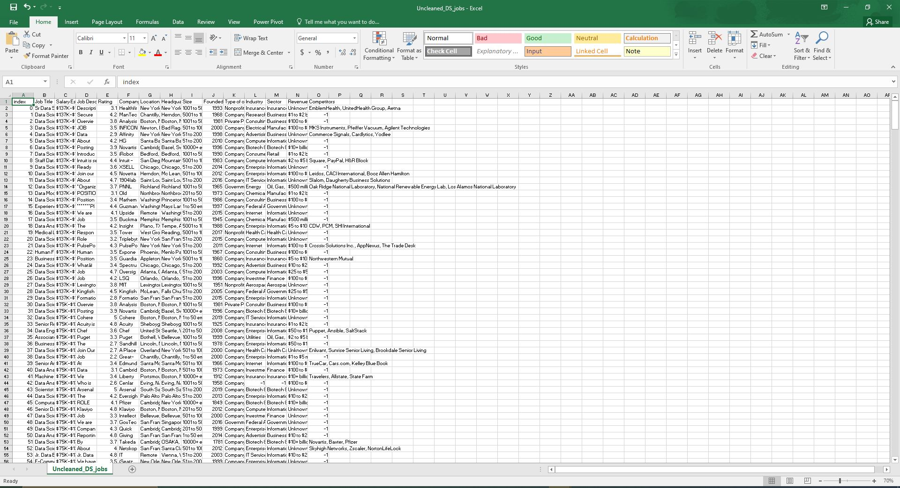
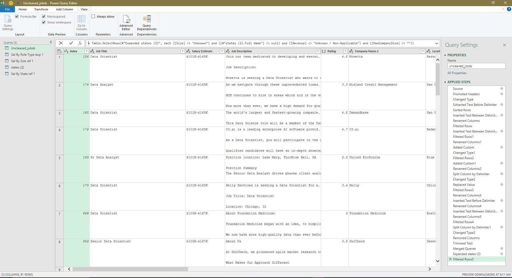

## Midterm Lab Task 2 -  Data Cleaning and Preparation using POWER QUERY
* Task Description:
Company X wants to clean and analyze job posting data from the Uncleaned_DS_Jobs.csv dataset (from Kaggle). The goal is to answer these questions:

1. Which job roles pay the most and least?
2. Which company sizes pay the best?
3. Where do specific job roles or titles pay the best and worst in a particular state?
   
# Steps Performed in Data Cleaning and Transformation:
* <ins>Clean Salary Estimate Column:
> <sup>Remove all characters after "(" in the Salary Estimate column and Use Transform → Extract → Text Before Delimiter and type "(".
* <ins>Create Min and Max Salary Columns:
> <sup>Create two new columns from Salary Estimate for Min Salary and Max Salary and Use Column from Examples → From Selection, then type values like 101 for Min Salary.
* <ins>Create Role Type Column:
> <sup>Categorize job titles into types like "Data Scientist", "Data Analyst", etc., using a Custom Column.
>> ***Example:***
```
if Text.Contains([Job Title], "Data Scientist") then  
"Data Scientist" 
else if Text.Contains([Job Title], "Data Analyst") then  
"Data Analyst" 
else if Text.Contains([Job Title], "Data Engineer") then  
"Data Engineer"
else if Text.Contains([Job Title], "Machine Learning") then  
"Machine Learning Engineer" 
else  
"other" 
```
* <ins>Fix Location Column:
> <sup>Correct the Location column by replacing city names with state abbreviations (e.g., "California" to ", CA").\
> Use Custom Column to replace city names, then split the column.
* <ins>Handle Negative Values:
> <sup>See competitors column filter all -1’s\
See revenues column filter 0’s\
See industry column filter -1’s 
* <ins>Clean Company Names:
> <sup>Remove unwanted words like "Rates" from the company name.
* Remove Unnecessary Columns:
> <sup>Delete columns like Description that are not needed for analysis.

# Screenshot of Dataset Before Cleaning and Transformation

# Final Output (Screenshot of Final Queries):
# Normalization
* _Dependencies and References of the QUERIES_

# Uncleaned DS Jobs(_Cleaned Data_)


# Sal by Role Type dupl


# Sal by Size ref


# Sal by State ref


