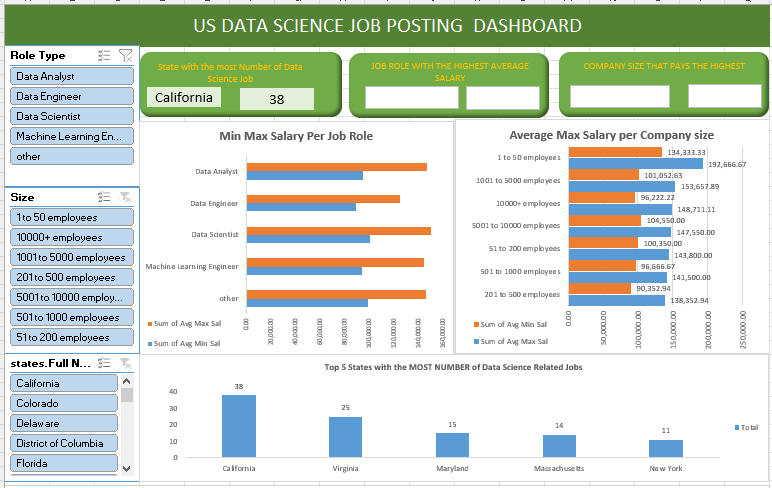

## Midterm Lab Task 3. Creating PIVOT TABLE and DASHBOARD
* Using the Worksheet on Uncleaned DS Jobs and the transform tables 
> Sal By Role, Sal By State, Sal by Size 

# Design your DASHBOARD that would highlight the ff: a. State with the most Number of Data Science 
> b. Job Role with the Highest Average Salary (Complete the dashboard as shown below)\
c. Which Company Size pays the Highest(Complete the dashboard as shown below)\
d. Which Sector Employs the Lowest and Highest Data Science related Jobs\
e. Which Sector has the Minimum Average Salary and Maximum average Salary
i. Note, you need to create another query to create a PIVOT Table for d and e 
# Normalization
* Do the necessary Pivot Table, and appropriate charts for the necessary reports as shown 
*  Insert Slicers for Role Type, Size and State 
*  You may insert MAP if your Excel version has one (See sample map) 
*  You may apply your own design and colour settings to make your DASHBOARD look more 
appealing and presentable 
*  The dashboard below is not yet complete you need to finished it and provide all the necessary 
VISUALS/Reports stated under number 2. 
*  The Slicers should make your Dashboard interactive 

## Final Output (Screenshot of Final Queries):
* **Dashboard**

* **Map**
  

